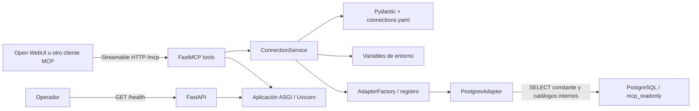
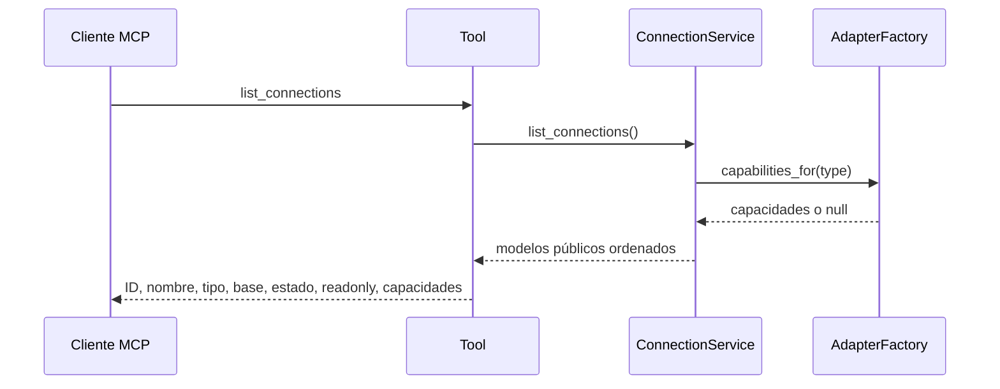
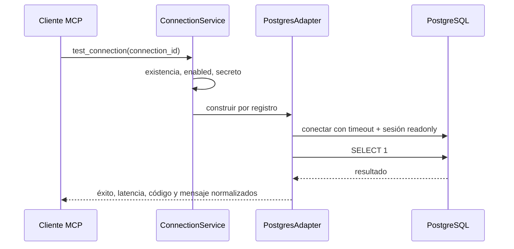

# Arquitectura de Data Platform MCP

## Alcance actual

Sprint 1 implementa configuración validada, descubrimiento de conexiones, pruebas de conectividad y
metadata PostgreSQL. No implementa catálogo persistente, consultas SQL de usuario, generación,
RAG, auditoría ni integración funcional con Open WebUI.

## Principios

1. El núcleo MCP no depende de un proveedor LLM.
2. Transporte, casos de uso y adaptadores se mantienen separados.
3. Los secretos solo se resuelven desde el entorno y no forman parte de respuestas.
4. Una conexión habilitada debe declararse readonly y tener un adaptador registrado.
5. Cada adaptador publica capacidades explícitas; no hay condicionales centrales por motor.
6. Generar SQL y ejecutarlo serán casos de uso distintos en sprints posteriores.

## Componentes implementados

- `app/config`: carga segura de YAML y normalización de errores.
- `app/models`: declaraciones, capacidades y resultados tipados.
- `app/services`: acceso a declaraciones, resolución de secretos y orquestación.
- `app/adapters`: contrato SQL, fábrica por registro y PostgreSQL.
- `app/tools`: contratos MCP del sprint.
- `app/container.py`: composition root y caché de configuración por proceso.
- `database/init`: esquema/datos de laboratorio y rol de solo lectura.

El lifespan de FastAPI valida el archivo, adaptadores y secretos antes de aceptar tráfico. Modificar
el YAML no requiere reconstruir la imagen, pero sí reiniciar el proceso para invalidar la caché.

## Flujo de `list_connections`

Este flujo no resuelve contraseñas y excluye host, usuario, `password_env` y cadenas de conexión.

## Flujo de `test_connection`

Los errores de driver no cruzan el límite MCP y no incluyen secretos ni detalles de conexión.

## Contrato de metadata PostgreSQL

`PostgresAdapter` implementa:

- `list_schemas`: schemas visibles no internos.
- `list_tables`: tablas/particiones visibles, con filtro opcional de schema.
- `describe_table`: columnas, defaults, PK y FK, incluso claves compuestas.

Las sentencias provienen exclusivamente del código; schema y tabla son parámetros del driver. El
adaptador no acepta ni ejecuta SQL enviado por usuarios. Las tools de metadata se incorporarán en
Sprint 4, después del catálogo de Sprint 2.

## Despliegue

`data-platform-mcp` y `postgres-lab` comparten la red Docker externa `ai-platform`. Open WebUI en
otro Compose puede resolver `data-platform-mcp:8000` porque comparte esa red. Ambos puertos están
limitados a loopback del anfitrión por defecto.

El runtime MCP usa Python 3.12, usuario no-root, filesystem de solo lectura y un único worker. El
laboratorio deriva de `postgres:17.10-bookworm`, incorpora sus scripts de inicialización en una
etapa Docker reproducible y usa un volumen nombrado. Evitar un bind mount de scripts también elimina
diferencias entre VirtioFS de Docker Desktop y volúmenes Linux. Ambas imágenes disponen de ARM64;
el diseño es compatible con Oracle Cloud Free Tier, aunque límites de recursos y backup deben
definirse según el despliegue real.

## Riesgos y límites

- `ai-platform` debe existir antes del arranque.
- El cambio de contraseña del laboratorio solo se aplica durante la inicialización de un volumen
  nuevo; para regenerarlo usa `docker compose down --volumes`.
- `/health` es liveness, no verifica PostgreSQL; el estado de una conexión se consulta por MCP.
- No hay autenticación MCP en este sprint: la red compartida es una frontera operativa.
- `sslmode: disable` existe solo en el ejemplo de laboratorio. Conexiones remotas deben configurar
  TLS según la política del servidor.
- `query_timeout_seconds` y `max_rows` se validan para contratos futuros, pero no hay ejecución de
  consultas de usuario en Sprint 1.
- Las imágenes están fijadas por versión, no por digest; supply-chain hardening queda para Sprint 10.
