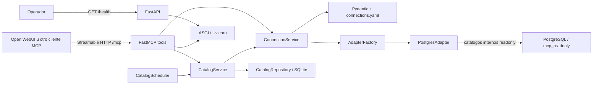
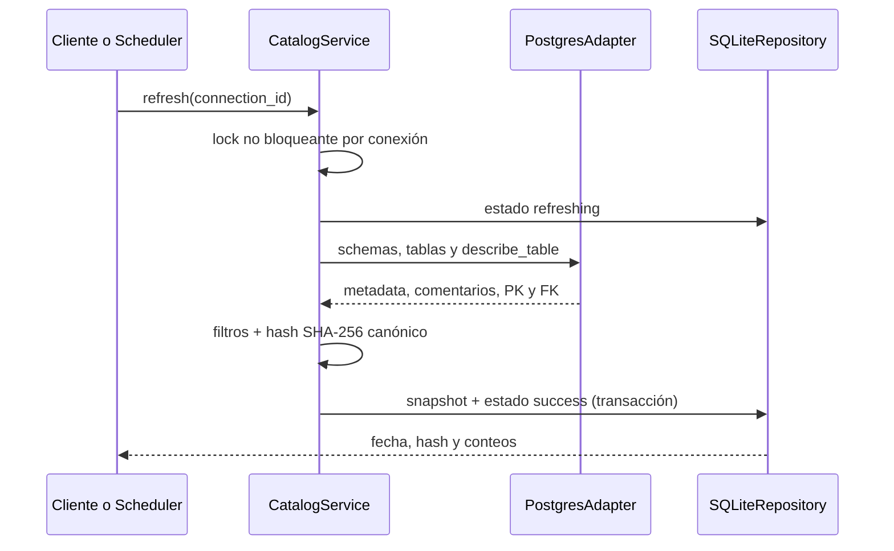

# Arquitectura de Data Platform MCP

## Alcance actual

Sprint 2 implementa configuración validada, conectividad/metadata PostgreSQL y un catálogo
persistente consultable. No implementa SQL de usuario, generación, RAG, auditoría ni integración
funcional con Open WebUI.

## Principios

1. El núcleo MCP no depende de un proveedor LLM.
2. Transporte, casos de uso, persistencia y adaptadores se mantienen separados.
3. Los secretos se resuelven desde el entorno y nunca forman parte del catálogo o respuestas.
4. Una conexión habilitada debe ser readonly y tener un adaptador registrado.
5. El catálogo almacena solo metadata técnica; nunca filas de negocio.
6. Un fallo de refresh conserva el último snapshot válido.
7. Generar y ejecutar SQL serán casos de uso distintos en sprints posteriores.

## Componentes implementados

- `app/config`: carga de YAML y normalización de errores.
- `app/models`: conexiones, snapshots, refresh, búsqueda y relaciones tipadas.
- `app/services`: resolución de conexiones y orquestación del catálogo.
- `app/adapters`: contrato SQL, fábrica por registro y PostgreSQL.
- `app/repositories`: contrato de persistencia e implementación SQLite.
- `app/scheduler`: actualización periódica en un worker thread sin bloquear ASGI.
- `app/tools`: seis contratos MCP disponibles en Sprint 2.
- `app/container.py`: composition root y dependencias cacheadas por proceso.

El lifespan valida conexiones/secretos, inicializa SQLite y arranca el scheduler. Al apagar, espera
la actualización en curso antes de cerrar.

## Flujo de refresh

Dos refreshes simultáneos de la misma conexión no se solapan; el segundo devuelve
`already_running`. Distintas conexiones pueden coordinarse independientemente. Si el adaptador
falla, se registra el intento como `error` sin reemplazar `catalog_snapshots`.

## Flujo de búsqueda

`search_catalog` lee únicamente SQLite. Normaliza los términos, filtra opcionalmente por conexión,
busca coincidencia AND sobre nombres/comentarios de tablas y columnas, ordena por relevancia y
añade las FK entrantes/salientes de cada tabla. La respuesta incluye el estado de frescura para que
el cliente pueda distinguir resultados actuales de un último snapshot obsoleto.

## Persistencia y despliegue

SQLite guarda un snapshot JSON por conexión y el estado del último intento en tablas separadas.
WAL y `busy_timeout` reducen contención; la sustitución del snapshot y el estado exitoso ocurren en
una transacción. El volumen nombrado `catalog-data` monta `/app/data`, la única ruta escribible del
runtime aparte de `/tmp`.

MCP y PostgreSQL comparten la red Docker externa `ai-platform`; Open WebUI puede vivir en otro
Compose y resolver `data-platform-mcp:8000`. Las imágenes fijadas de Python 3.12 y PostgreSQL
disponen de ARM64. El diseño de un proceso y SQLite es adecuado para una instancia pequeña de
Oracle Cloud Free Tier; despliegues con réplicas requerirán persistencia/coordinación compartida.

## Riesgos y límites

- `ai-platform` debe existir antes del arranque.
- `/health` es liveness y no verifica base ni frescura; usa `get_schema_cache_status`.
- El scheduler es por proceso. No ejecutar múltiples réplicas contra el mismo archivo SQLite.
- Comentarios del catálogo son metadata controlada por administradores, pero se tratan como texto
  no confiable en consumidores futuros.
- No hay autenticación MCP; la red compartida es una frontera operativa provisional.
- Las imágenes están fijadas por versión, no por digest; hardening de supply chain queda pendiente.
- `query_timeout_seconds` y `max_rows` no habilitan ejecución SQL en este sprint.
