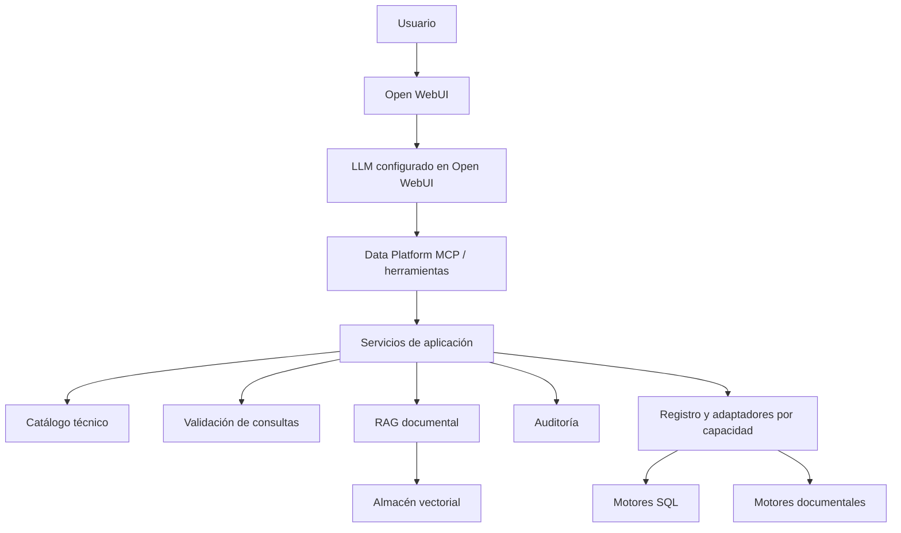
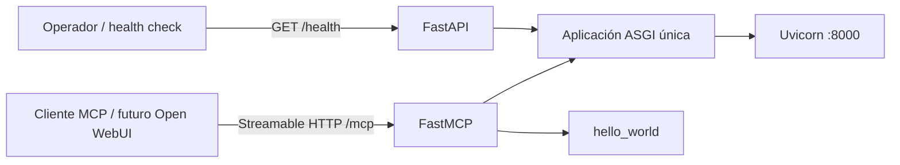
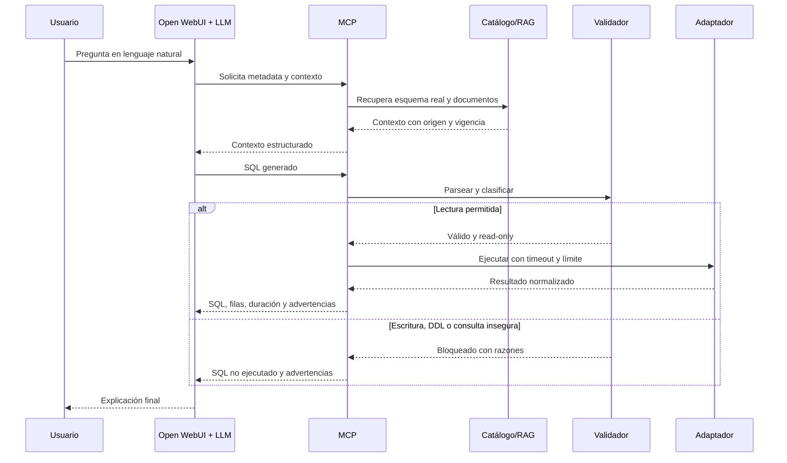

# Arquitectura de Data Platform MCP

## Alcance de este documento

Este documento separa el diseño objetivo de la plataforma de lo realmente implementado en
Sprint 0. El código actual solo proporciona el runtime ASGI, `GET /health`, `/mcp` y
`hello_world`. Todo componente de datos descrito como futuro está pendiente y no debe interpretarse
como soporte disponible.

## Principios

1. El núcleo MCP no depende de OpenAI, Ollama, Claude, BytePlus ni otro proveedor de LLM.
2. Los modelos de transporte, servicios de negocio y adaptadores de datos permanecen separados.
3. Generar una sentencia y ejecutarla son casos de uso distintos; solo lecturas validadas podrán
   llegar a un adaptador de ejecución.
4. Los motores SQL y documentales declaran capacidades diferentes; MongoDB no se fuerza a usar una
   interfaz SQL.
5. Los secretos se resolverán desde el entorno y nunca formarán parte de respuestas, logs o
   archivos versionados.
6. La plataforma se desarrolla incrementalmente; una carpeta prevista no implica funcionalidad.

## Componentes objetivo



Responsabilidades objetivo:

- **API administrativa:** liveness, readiness, versión y observabilidad; no ofrece un bypass para
  ejecutar consultas.
- **Herramientas MCP:** contratos estables y orientados al LLM para metadatos, catálogo, validación,
  ejecución de lectura y RAG.
- **Servicios:** reglas de negocio independientes del transporte y del motor.
- **Adaptadores:** integración con cada motor y declaración explícita de capacidades.
- **Catálogo:** metadatos reales, vigencia y último snapshot válido; nunca filas de negocio.
- **RAG:** contexto documental funcional, separado del catálogo técnico.
- **Auditoría:** resultado de validaciones y ejecuciones sin secretos ni datos completos.

## Arquitectura implementada en Sprint 0



La aplicación FastMCP crea el lifespan ASGI que se entrega a FastAPI. Sus rutas Streamable HTTP se
integran en la aplicación combinada; así un solo proceso administra correctamente el ciclo de vida
MCP y expone el health check sin un segundo puerto.

Estructura activa:

```text
app/
├── api/               # Endpoints administrativos
├── models/            # Contratos tipados de transporte
├── tools/             # Implementaciones y registro MCP
└── main.py            # Composición ASGI

tests/
└── unit/              # Health check y hello_world/MCP
```

Las capas `adapters`, `services`, `repositories`, `catalog`, `rag`, `security` y `audit` se crearán
cuando una historia introduzca comportamiento real. No se agregaron interfaces vacías ni
implementaciones simuladas en Sprint 0.

## Flujo de consulta objetivo



Este flujo comienza a implementarse en Sprint 1. En Sprint 0 no existe generación, validación ni
ejecución de consultas.

## Separación entre generación y ejecución

El diseño objetivo usará casos de uso diferentes:

```text
GenerateSqlUseCase ──> SQL + clasificación + advertencias
ExecuteReadQueryUseCase ──> validación obligatoria ──> adaptador read-only
```

No habrá una ruta de confirmación que convierta DML o DDL en ejecutable. La futura herramienta
`generate_sql` podrá preparar contexto para el LLM de Open WebUI; el servidor MCP no requerirá por
ello una API key ni contendrá una dependencia obligatoria hacia un proveedor.

## Decisiones de despliegue

### Python y dependencias

- Runtime fijado en Python `3.12.13` sobre Debian Bookworm slim.
- FastAPI y FastMCP usan rangos menores controlados; las versiones mayores requieren revisión.
- El perfil `test` de Docker instala pytest, Ruff y mypy para validar con el mismo Python 3.12 del
  VPS, incluso si el equipo anfitrión usa otra versión.

### ARM64 y Oracle Cloud Free Tier

La imagen oficial de Python seleccionada publica una variante Linux ARM64. El servicio usa un solo
worker y no incorpora PostgreSQL, Qdrant, compiladores ni drivers en Sprint 0, lo que reduce memoria
y almacenamiento. Un despliegue productivo deberá fijar límites de CPU/memoria tras medir la forma
de carga real; inventarlos ahora podría ocultar problemas.

### Docker y red compartida

`compose.yaml` declara `ai-platform` como `external: true`; Compose no la crea ni gestiona. Open
WebUI, aun ejecutándose desde otro Compose, puede resolver `data-platform-mcp` mediante el DNS de la
red compartida. El puerto del anfitrión se enlaza a loopback por defecto y la comunicación entre
contenedores usa directamente la red.

### Seguridad del contenedor

El runtime se ejecuta con UID/GID `10001`, sin capabilities, sin elevación de privilegios y con raíz
de solo lectura. `/tmp` es un `tmpfs` limitado. Estas medidas no sustituyen autenticación ni
segmentación de red, que quedan pendientes de hardening.

## Riesgos y limitaciones conocidas

- La red `ai-platform` debe existir antes de `docker compose up`; si falta, Compose falla de forma
  intencional.
- Sprint 0 no implementa autenticación MCP. El endpoint no debe publicarse a Internet y la red
  compartida debe considerarse confiable.
- La compatibilidad funcional con la versión concreta de Open WebUI se validará en Sprint 8; en este
  sprint solo se garantiza transporte MCP Streamable HTTP estándar y conectividad Docker.
- Las etiquetas de dependencias e imagen base están acotadas por versión pero no por digest. Un
  proceso de actualización y verificación de supply chain se definirá durante hardening.
- `/health` solo indica que el proceso está vivo. `/ready`, `/version` y `/metrics` se añadirán cuando
  existan dependencias y observabilidad que justifiquen sus contratos.
- No existen conexiones, parser SQL, catálogo, auditoría, RAG ni adaptadores. Cualquier intento de
  consulta de datos está fuera del alcance actual.
- Drivers como Informix pueden no publicar artefactos ARM64; Sprint 9 debe validar disponibilidad
  real antes de declarar soporte.
