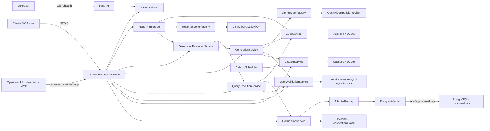

# Arquitectura de Data Platform MCP

## Alcance actual

Sprint 4 expone la metadata PostgreSQL cacheada mediante herramientas MCP estructuradas y
versionadas. Conserva validación SQL real, ejecución exclusivamente de lectura, `EXPLAIN` seguro,
auditoría, configuración y catálogo persistente de sprints anteriores. Sprint 5 añade generación de
SQL asistida por LLM sobre el catálogo cacheado (`generate_sql`, `generate_and_execute_query`),
solicitud estructurada de aclaraciones ante ambigüedad, y generación de reportes XLSX/PDF/CSV/JSON
desde lenguaje natural (`generate_report`), entregados en línea como bytes base64 sin usar disco.
Todo el bloque de generación es opcional y está deshabilitado por defecto, sin introducir ningún
camino de ejecución que evite la validación existente. No implementa RAG, procedimientos, triggers
ni escritura.

## Principios

1. El núcleo MCP no depende de un proveedor LLM.
2. Transporte, casos de uso, persistencia, políticas SQL y adaptadores se mantienen separados.
3. Toda consulta de usuario se parsea y valida antes de poder obtener un adaptador ejecutable.
4. Una conexión habilitada debe ser readonly y tener un adaptador registrado.
5. La seguridad combina AST, límites de aplicación, sesión readonly y permisos del rol de base.
6. El catálogo almacena solo metadata; la auditoría no almacena SQL, parámetros ni resultados.
7. Generar y ejecutar SQL son casos de uso distintos; la generación natural queda en Sprint 5.
8. Los contratos MCP versionados leen el snapshot SQLite y no abren una segunda ruta de acceso a
   PostgreSQL.
9. La versión del servidor y la versión del contrato evolucionan de forma independiente.

## Componentes implementados



- `app/config`: carga de YAML y normalización de errores.
- `app/models`: contratos tipados de conexiones, catálogo, metadata MCP, validación, ejecución,
  auditoría, generación LLM y reportes.
- `app/security`: reglas PostgreSQL aplicadas sobre el árbol sintáctico.
- `app/services`: casos de uso de conexión, catálogo, validación, ejecución, auditoría y generación
  asistida por LLM.
- `app/adapters`: contrato SQL, fábrica por registro y adaptación PostgreSQL.
- `app/generation`: contrato de proveedor LLM, fábrica por registro, selección de contexto de
  catálogo, construcción de prompts y parseo de la respuesta del modelo.
- `app/reporting`: resolución determinística de periodos relativos (sin LLM) y exportadores
  CSV/JSON/XLSX/PDF por registro, orquestados por `ReportingService` sobre
  `GenerationExecutionService`.
- `app/repositories`: contratos e implementaciones SQLite para catálogo y auditoría.
- `app/scheduler`: actualización del catálogo en un worker thread sin bloquear ASGI.
- `app/tools`: 18 herramientas; las respuestas de exploración, generación y reportes usan el
  contrato MCP `1.0.0`.
- `app/container.py`: composition root y dependencias cacheadas por proceso.

El lifespan valida conexiones y secretos, inicializa ambas persistencias SQLite y arranca el
scheduler. Al apagar, espera la actualización de catálogo en curso antes de cerrar.

## Flujo de validación y ejecución

```mermaid
sequenceDiagram
    participant C as Cliente MCP
    participant E as QueryExecutionService
    participant V as QueryValidationService
    participant A as PostgresAdapter
    participant P as PostgreSQL readonly
    participant R as AuditRepository
    C->>E: execute_read_query(SQL, parámetros, límites)
    E->>V: parsear PostgreSQL y validar AST
    alt bloqueada o parámetros distintos
        V-->>E: executable=false + razones
        E->>R: hash + decisión blocked
        E-->>C: no ejecutada; el adaptador no se obtiene
    else SELECT permitido
        V-->>E: SQL normalizado + objetos + placeholders
        E->>V: aplicar LIMIT exterior efectivo
        E->>A: SQL validado, parámetros y límites
        A->>P: sesión readonly + timeouts
        P-->>A: columnas y filas acotadas
        A->>A: rollback + serialización acotada
        A-->>E: resultado normalizado
        E->>R: hash + duración + conteo
        E-->>C: columnas, filas, duración y advertencias
    end
```

La allowlist acepta una sola raíz `SELECT`/operación de conjuntos. El análisis del AST bloquea DML,
DDL, privilegios, `COPY`, comandos administrativos, escritura en CTE, `SELECT INTO`, locking reads,
funciones peligrosas conocidas y parámetros posicionales. El servicio exige coincidencia exacta de
placeholders nombrados, reescribe el límite con el AST y solo entonces solicita el adaptador.

El límite efectivo de filas es el menor entre solicitud, conexión y configuración global. El timeout
efectivo nunca excede el de la conexión. Un semáforo de proceso limita concurrencia y el adaptador
limita además bytes serializados. Toda transacción de consulta termina con `ROLLBACK`.

## Flujo de plan

`explain_query` reutiliza exactamente la validación y los límites anteriores. El cliente entrega un
`SELECT`, no una sentencia `EXPLAIN`; el adaptador antepone una constante
`EXPLAIN (FORMAT JSON, ANALYZE FALSE, VERBOSE FALSE, COSTS TRUE)`. PostgreSQL devuelve un plan JSON
normalizado. Al no usar `ANALYZE`, la consulta explicada no se ejecuta.

## Catálogo

`CatalogService` mantiene snapshots atómicos de metadata. Dos refreshes simultáneos de una misma
conexión no se solapan y un error conserva el último snapshot válido. `search_catalog` consulta solo
SQLite, incluye frescura y adjunta relaciones FK relevantes. `list_schemas`, `list_tables`,
`describe_table` y `list_relationships` leen el mismo snapshot, identifican `connection_id` e
incluyen el estado del caché. Si no existe snapshot, el error indica ejecutar
`refresh_schema_cache`.

El adaptador conserva PK e índices únicos simples/completos junto con las FK. Una FK cuyas columnas
origen coinciden con una PK o clave única se informa como `one-to-one`; en los demás casos se
informa `many-to-one`. `cardinality_inference` hace explícita la evidencia utilizada. Esta inferencia
describe el máximo origen→destino y no intenta deducir opcionalidad ni reglas funcionales desde
filas. El detalle operativo permanece en [catalog.md](catalog.md).

## Transportes y contratos MCP

`app.tools.server:mcp` es el único registro. FastAPI monta su aplicación Streamable HTTP en `/mcp`;
el entry point `data-platform-mcp-stdio` llama `mcp.run()` con el transporte STDIO predeterminado.
Así ambos transportes comparten nombres, schemas de entrada/salida y versión del servidor.

Los envelopes añadidos en Sprint 4 incluyen `contract_version: "1.0.0"`. El servidor se publica
como `0.6.0`; un cambio de implementación no obliga a romper el contrato. Las pruebas consultan
`list_tools`, fijan los 15 nombres y validan los JSON Schemas de entrada/salida. La política de
compatibilidad y el catálogo completo están en [mcp-contracts.md](mcp-contracts.md) y
[mcp-tools.md](mcp-tools.md).

## Persistencia y despliegue

`catalog.db` guarda metadata técnica; `audit.db` guarda eventos de seguridad append-only con hash
SHA-256 del texto original. Ambos usan WAL y `busy_timeout` y residen en `/app/data`, montado desde el
volumen nombrado `catalog-data`; ninguna tabla de auditoría contiene SQL, parámetros o valores.

MCP y PostgreSQL comparten la red Docker externa `ai-platform`; Open WebUI puede vivir en otro
Compose y resolver `data-platform-mcp:8000`. Las imágenes fijadas de Python 3.12 y PostgreSQL tienen
variantes ARM64. Un proceso con SQLite y concurrencia acotada es compatible con una instancia pequeña
de Oracle Cloud Free Tier; múltiples réplicas requerirían persistencia y coordinación compartidas.

## Riesgos y límites

- El parser determina estructura, no los efectos internos de toda función definida por el usuario.
  El administrador debe limitar `EXECUTE` a funciones confiables; el rol/sesión readonly bloquea
  escrituras PostgreSQL, pero una función privilegiada podría tener efectos externos.
- La denylist complementa una allowlist estructural y debe revisarse al actualizar PostgreSQL o
  SQLGlot.
- El semáforo y el scheduler son por proceso; SQLite no es la opción para múltiples réplicas.
- `/health` es liveness, no readiness de PostgreSQL ni del catálogo.
- No hay autenticación MCP; `ai-platform` sigue siendo una frontera operativa provisional.
- La cardinalidad se infiere solo desde unicidad declarada; no modela relaciones muchos-a-muchos
  implícitas, nulabilidad semántica ni restricciones externas a PostgreSQL.
- Las imágenes se fijan por versión, no por digest; supply-chain hardening queda pendiente.
